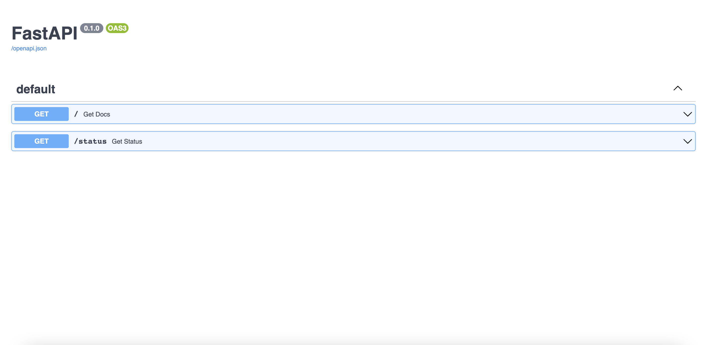

# Lightning Fast API
Very minimum dockerized FastAPI. This is useful when you create a single endpoint API etc..


# What is this?
This repository contains very minimum tool-kit to run FastAPI based API service.
It contains the following features.

1. Fast API based API server (src/main.py)
2. Status and docs endpoints (src/endpoints)
2. Logger (src/utils/__init__.py)
3. Error handler (src/utils/custom_error_handlers.py)
4. Config loader (src/utils/config_loader.py)
5. Dockerfile

# How to launch?

## With Python3.8
```
pip install -r requirements.txt
```

```
pytho src/main.py
```

## With Docker
```
docker build -t lightning_fast_api_image . && docker run -p 80:80 -d --name lightning_fast_api lightning_fast_api_image 
```

## Swagger doc
If you managed to run the application, you should be able to access to `localhost:80` and see the Swagger documentation like this.


## Fork and star this repo! Thanks!


